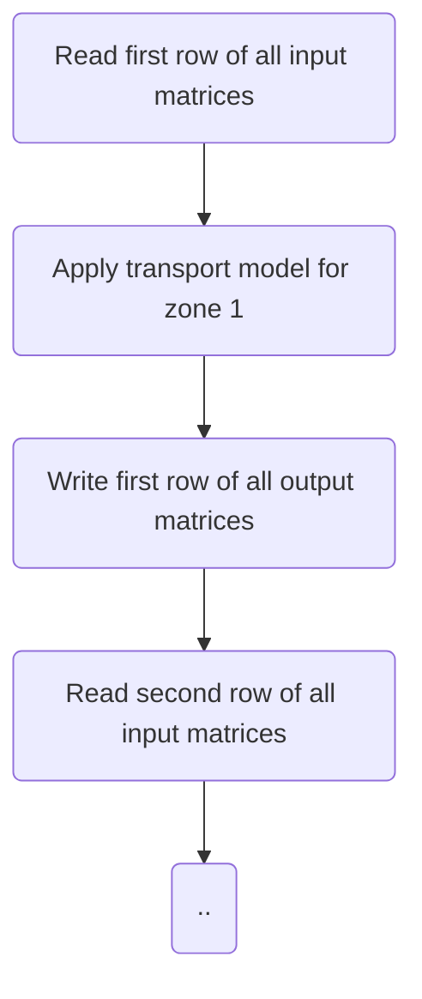

# matio

The matio-library aims to facilitate the reading and writing of matrix files in transport models, in a way that allows to switch easily between [matrix formats](https://github.com/transportmodelling/matio/wiki/File-formats).

The following diagram shows an efficient structure for a transport model:


The main advantage of this structure is that only one row of each matrix needs to be kept in memory when the model is applied to a zone. MatrixReader and MatrixWriter-objects facilitate this structure by reading/writing one row of each matrix (in ascending order) from/to a file containing one or more matrices.

The MatrixReader and MatrixWriter-objects can be instantiated by providing a [key-value string specifying the desired format and other (format specific) properties](https://github.com/transportmodelling/matio/wiki/File-specification), for example:

```
var Reader := MatrixFormats.CreateReader('file=matrix.dat; format=txt; delim=comma');
```

will create a MatrixReader-object that reads matrices from a comma-separated text file named 'matrix.dat'.

The following formats are supported by the matio-library:

 -	Text format (various encodings and separators)
 -	The binary Minutp-format that can be used within Citilab's CUBE
 -  [Open Matrix Format (omx)](https://github.com/osPlanning/omx)
 -	The binary 4G-format that is being used within the national transport models of Flanders and the Netherlands.

Support for other formats can be added by registering the format at the global MatrixFormats-object.

# Dependencies
Before you can compile this library, you will need to clone the https://github.com/transportmodelling/Utils repository, and then add it to your Delphi Library path.
